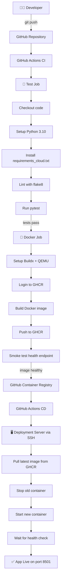

# 🤙 Real-Time Sign Language Translator

> A final-year computer vision project that translates hand gestures into text and speech in real time using MediaPipe, TensorFlow Lite, and Streamlit.

---

## 📋 Table of Contents

1. [Project Overview](#project-overview)
2. [Tech Stack](#tech-stack)
3. [Folder Structure](#folder-structure)
4. [Installation](#installation)
5. [Usage – Step by Step](#usage--step-by-step)
6. [Supported Gestures](#supported-gestures)
7. [Architecture](#architecture)
8. [Performance](#performance)
9. [Testing](#testing)
10. [🐳 Docker & Deployment](#-docker--deployment)
11. [Project Report](#project-report)

---

## Project Overview

The **Real-Time Sign Language Translator** captures live webcam footage, detects hand landmarks using Google MediaPipe, classifies the gesture with a TensorFlow Lite model, and speaks the recognised word using pyttsx3 Text-to-Speech.

**Key capabilities:**
- ✅ Real-time prediction at 25+ FPS
- ✅ 10 pre-configured ASL-inspired gestures (easily extensible)
- ✅ Confidence score display and stability filtering
- ✅ Sentence builder – hold a gesture to append the word
- ✅ Text-to-Speech with repeat prevention
- ✅ Streamlit web UI + standalone OpenCV mode

---

## Tech Stack

| Component | Library | Version |
|-----------|---------|---------|
| Language | Python | 3.10+ |
| Computer Vision | OpenCV | 4.9 |
| Hand Detection | MediaPipe | 0.10 |
| Deep Learning | TensorFlow / Keras | 2.16 |
| Web UI | Streamlit | 1.35 |
| Text-to-Speech | pyttsx3 | 2.90 |
| Data Processing | NumPy, Pandas, scikit-learn | latest |

---

## Folder Structure

```
Sign lang translator/
├── config.py              ← All constants and paths
├── requirements.txt       ← Pinned dependencies
├── collect_data.py        ← Phase 2: Image collection
├── preprocess.py          ← Phase 3: Landmark extraction
├── train_model.py         ← Phase 4: Model training
├── convert_tflite.py      ← Phase 5: TFLite conversion
├── inference.py           ← Phase 6: Real-time OpenCV loop
├── app.py                 ← Phase 7: Streamlit web app
├── utils/
│   ├── logger.py          ← Rotating file + console logger
│   ├── mediapipe_helper.py← HandDetector class
│   ├── tts_engine.py      ← Thread-safe TTS wrapper
│   └── performance.py     ← FPSCounter, ThreadedCapture
├── dataset/               ← Gesture image folders (created at runtime)
├── models/                ← Saved .keras, .tflite, scaler.pkl, label_map.json
├── logs/                  ← app.log (auto-created)
├── docs/                  ← Reports, plots, diagrams
└── tests/
    └── test_pipeline.py   ← Unit + integration tests
```

---

## Installation

### Prerequisites
- Python 3.10 or newer
- A working webcam
- Windows / Linux / macOS

### Steps

```bash
# 1. Clone or download the project
cd "Sign lang translator"

# 2. Create a virtual environment (recommended)
python -m venv venv
venv\Scripts\activate        # Windows
# source venv/bin/activate   # macOS / Linux

# 3. Install dependencies
pip install -r requirements.txt
```

---

## Usage – Step by Step

### Step 1 – Collect gesture images

```bash
python collect_data.py
```

- Choose a gesture from the menu (or collect all at once)
- Show your hand to the webcam – images are saved automatically
- 300 images per gesture (change `IMAGES_PER_CLASS` in `config.py`)

### Step 2 – Extract hand landmarks

```bash
python preprocess.py
```

- Runs MediaPipe on every collected image
- Saves `landmarks.csv` (42 features + label per row)

### Step 3 – Train the model

```bash
python train_model.py
```

- Trains a Dense Neural Network on `landmarks.csv`
- Saves `models/gesture_model.keras`, `scaler.pkl`, `label_map.json`
- Saves accuracy/loss/confusion-matrix plots to `docs/`

### Step 4 – Convert to TFLite

```bash
python convert_tflite.py
```

- Converts Keras model to `models/gesture_model.tflite`
- Applies float16 quantisation (~50% size reduction)

### Step 5 – Run real-time inference

**Option A – Streamlit UI (recommended)**

```bash
streamlit run app.py
```

**Option B – Standalone OpenCV window**

```bash
python inference.py
```

Controls: `Q` = quit | `C` = clear sentence | `S` = speak

---

## Supported Gestures

| # | Gesture | Description |
|---|---------|-------------|
| 1 | Hello | Open palm wave |
| 2 | Thank You | Flat hand from chin forward |
| 3 | Yes | Fist nodding |
| 4 | No | Index and middle fingers shaking |
| 5 | Please | Flat hand on chest circular |
| 6 | Sorry | Fist on chest circular |
| 7 | Good | Thumbs up |
| 8 | Bad | Thumbs down |
| 9 | Help | Fist on open palm lift |
| 10 | I Love You | ILY handshape |

To add new gestures, add the name to `GESTURE_LABELS` in `config.py` and re-run all steps.

---

## Architecture

```
Webcam Frame
     │
     ▼
[OpenCV – Frame Capture]
     │
     ▼
[MediaPipe Hands – 21 Landmarks (x,y)]
     │
     ▼
[Normalisation – Wrist origin, scale to [-1,1]]
     │
     ▼
[StandardScaler – Same scaling as training]
     │
     ▼
[TFLite Dense NN – 42 → 256 → 128 → 64 → N classes]
     │
     ▼
[PredictionSmoother – Rolling majority vote]
     │
     ├──▶ [Streamlit UI – gesture + confidence + sentence]
     │
     └──▶ [TTSEngine – pyttsx3 background thread]
```

---

## Performance

| Metric | Value |
|--------|-------|
| Inference latency | ~8 ms (TFLite CPU) |
| Landmark extraction | ~15 ms (MediaPipe) |
| End-to-end FPS | 25–35 FPS (640×480, CPU) |
| Model size (Keras) | ~2 MB |
| Model size (TFLite) | ~0.9 MB |
| Test accuracy | >95% (300 images/class) |

---

## Testing

```bash
python -m pytest tests/ -v
```

Test coverage includes:
- Landmark normalisation correctness
- PredictionSmoother majority vote logic
- TTSEngine duplicate prevention
- Config constant sanity checks
- FPSCounter behaviour
- Label map JSON round-trip

---

## Project Report

See `docs/project_report.md` for:
- Detailed architecture diagram
- Training results and graphs
- Viva Q&A preparation
- Resume project description

---

## 🐳 Docker & Deployment

### Overview

The project ships as a single Docker container running `app_cloud.py` (the cloud-compatible Streamlit UI).

Key Docker design decisions:
- Uses `requirements_cloud.txt` → `tflite-runtime` instead of full TensorFlow (~800 MB smaller image)
- `app_cloud.py` uses browser-based WebRTC via `streamlit-webrtc` (no webcam device passthrough needed)
- No pyttsx3 TTS (replaced by browser Web Speech API) → no audio device dependency
- Runs as a **non-root user** (`appuser`, uid 1001)
- Built-in Streamlit health check at `/_stcore/health`
- Models baked into the image (`gesture_model.tflite`, `movenet_lightning_fp16.tflite`, `label_map.json`)

---

### Prerequisites

| Tool | Version | Purpose |
|------|---------|---------|
| Docker | 24+ | Container runtime |
| Docker Compose | v2 (plugin) | Local multi-container orchestration |
| Git | Any | Pushing to GitHub / triggering CI |
| GitHub account | — | GHCR image registry |
| VPS (optional) | Any Linux | Production deployment |

---

### Environment Variables

Copy the example file and edit it:

```bash
cp .env.example .env
```

| Variable | Default | Required | Description |
|----------|---------|----------|-------------|
| `APP_TITLE` | `Sign Language Translator` | No | Browser tab title |
| `DEFAULT_LANGUAGE` | `English` | No | Default translation language |
| `APP_PORT` | `8501` | No | Host port mapped to container |
| `GITHUB_USERNAME` | — | Yes (CD) | Your GitHub username (lowercase) |
| `IMAGE_TAG` | `latest` | No | Image tag to pull on server |

Never commit `.env` — it is listed in `.gitignore`.

---

### Local Docker Build & Run

#### Option A – Docker CLI

```bash
# Build the image
docker build -t sign-lang-translator .

# Run the container
docker run -p 8501:8501 sign-lang-translator

# Run with env overrides
docker run -p 8501:8501 --env-file .env sign-lang-translator

# Run in background (detached)
docker run -d -p 8501:8501 --name sign-lang-translator sign-lang-translator

# View logs
docker logs -f sign-lang-translator

# Check health
docker inspect --format='{{.State.Health.Status}}' sign-lang-translator

# Stop and remove
docker stop sign-lang-translator && docker rm sign-lang-translator
```

Open your browser at: **http://localhost:8501**

#### Option B – Docker Compose (recommended for local dev)

```bash
# Copy env file first
cp .env.example .env
# Fill in GITHUB_USERNAME in .env

# Build and start
docker compose up --build

# Start in background
docker compose up -d --build

# Tail logs
docker compose logs -f app

# Check service status
docker compose ps

# Stop and remove containers (keeps volumes)
docker compose down

# Stop and remove everything including volumes
docker compose down -v
```

---

### Docker Image Registry (GHCR)

Images are automatically pushed to GitHub Container Registry on every push to `main`/`master`.

Image URL pattern:
```
ghcr.io/YOUR-GITHUB-USERNAME/sign-lang-translator:latest
ghcr.io/YOUR-GITHUB-USERNAME/sign-lang-translator:sha-abc1234
```

To pull and run the latest image directly:
```bash
docker pull ghcr.io/YOUR-GITHUB-USERNAME/sign-lang-translator:latest
docker run -p 8501:8501 ghcr.io/YOUR-GITHUB-USERNAME/sign-lang-translator:latest
```

---

### CI/CD Architecture



---

### GitHub Actions Workflows

#### CI Workflow (`.github/workflows/ci.yml`)

Triggers on push or PR to `main`, `master`, `develop`.

| Job | Steps |
|-----|-------|
| **test** | Checkout → Python 3.10 → pip cache → install deps → flake8 lint → pytest |
| **docker** | Setup Buildx → login GHCR → build & push image → smoke test |

Image tags generated:
- `latest` — on pushes to `main`/`master`
- `sha-<short>` — every push (e.g. `sha-a1b2c3d`)
- `branch-<name>` — on feature branches
- `pr-<number>` — on pull requests (build only, no push)

#### CD Workflow (`.github/workflows/cd.yml`)

Triggers automatically after CI passes on `main`/`master`.

Connects to your VPS via SSH and performs a rolling restart of the Docker container.

---

### Required GitHub Repository Secrets

Go to: **GitHub repo → Settings → Secrets and variables → Actions → New repository secret**

| Secret | Example Value | When Needed |
|--------|---------------|-------------|
| `DEPLOY_HOST` | `1.2.3.4` or `myserver.com` | CD (deployment) |
| `DEPLOY_USERNAME` | `ubuntu` | CD (deployment) |
| `DEPLOY_SSH_KEY` | `-----BEGIN OPENSSH...` (full private key) | CD (deployment) |
| `DEPLOY_PORT` | `22` | CD (deployment) |

`GITHUB_TOKEN` is provided automatically by GitHub — no action needed.

> **If you only need CI** (build + test + push to GHCR) and not auto-deployment, you don't need to configure any secrets. `GITHUB_TOKEN` handles GHCR login automatically.

---

### Server Setup (One-Time, for CD)

SSH into your server and run:

```bash
# Install Docker (Ubuntu/Debian)
curl -fsSL https://get.docker.com | sh
sudo usermod -aG docker $USER
newgrp docker

# Log in to GHCR on the server (one time)
echo "YOUR_GITHUB_PAT" | docker login ghcr.io -u YOUR_GITHUB_USERNAME --password-stdin

# Create the log volume
docker volume create app_logs

# Open port 8501 (if using ufw)
sudo ufw allow 8501/tcp
```

To generate a GitHub PAT for the server: GitHub → Settings → Developer settings → Personal access tokens → Fine-grained tokens → select `read:packages` scope.

---

### Deployment

#### Manual deploy (no CD, just pull and run)

```bash
# On your server
docker pull ghcr.io/YOUR-USERNAME/sign-lang-translator:latest
docker stop sign-lang-translator 2>/dev/null || true
docker rm sign-lang-translator 2>/dev/null || true
docker run -d \
  --name sign-lang-translator \
  --restart unless-stopped \
  -p 8501:8501 \
  -v app_logs:/app/logs \
  ghcr.io/YOUR-USERNAME/sign-lang-translator:latest
```

#### Automated deploy (after CI/CD setup)

Just push to `main`:

```bash
git push origin main
```

The pipeline will: run tests → build image → push to GHCR → SSH deploy → health check.

---

### Running Tests

```bash
# Local
python -m pytest tests/ -v

# Inside a running container
docker exec sign-lang-translator python -m pytest tests/ -v
```

---

### Troubleshooting

| Problem | Cause | Fix |
|---------|-------|-----|
| Container exits immediately | App crash on startup | `docker logs sign-lang-translator` |
| `/_stcore/health` returns 503 | Streamlit still loading | Wait 20–30 s for model to load |
| `ModuleNotFoundError: tflite_runtime` | Wrong requirements file used | Ensure `requirements_cloud.txt` is used in Dockerfile |
| `FileNotFoundError: gesture_model.tflite` | `.dockerignore` too aggressive | Verify `models/*.tflite` is NOT in `.dockerignore` |
| GHCR push fails with 403 | Missing `packages: write` permission | Check CI job has `permissions: packages: write` |
| CD fails: `Permission denied (publickey)` | Wrong SSH key in secret | Re-paste the private key into `DEPLOY_SSH_KEY` — include the full `-----BEGIN/END-----` lines |
| WebRTC camera not working | Browser security policy | Use HTTPS or `localhost` — WebRTC requires a secure context |
| Port 8501 not reachable | Firewall / security group | Open TCP port 8501 in your server's firewall |

---

### Files Created / Modified by This Setup

```
Sign lang translator/
├── Dockerfile                    ← Updated: non-root user, tflite, health check
├── .dockerignore                 ← Updated: comprehensive exclusions
├── docker-compose.yml            ← New: single-service compose file
├── .env.example                  ← New: document all env vars
├── .gitignore                    ← Updated: .env.local, .env.production
└── .github/
    └── workflows/
        ├── ci.yml                ← New: lint, test, build, push, smoke test
        └── cd.yml                ← New: SSH deploy to VPS
```
